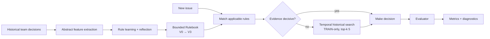
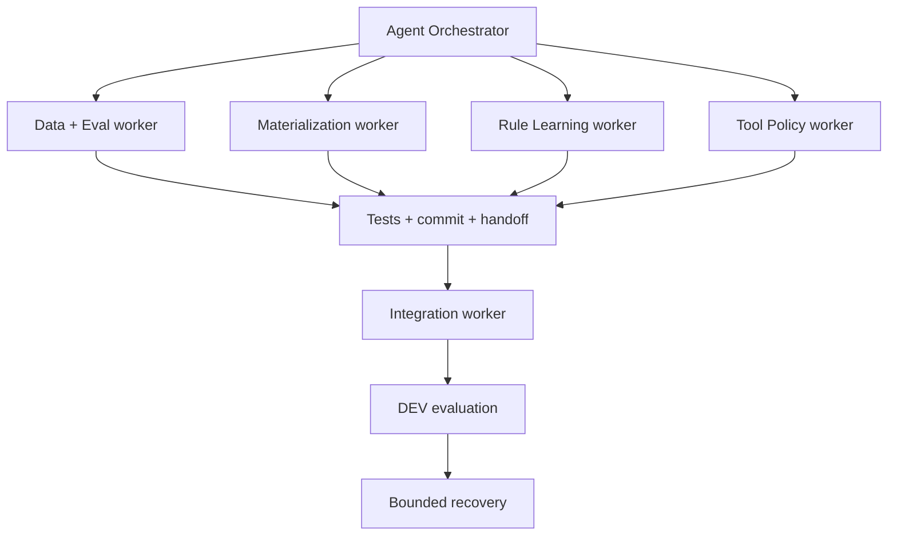

# Unwritten

> **Learn the rules nobody wrote down.**
>
> Generic agents know the tool. **Unwritten helps them learn the organization.**

**Unwritten turns a team's past decisions into a compact, evidence-backed rulebook that an agent can learn from, use while deciding when to retrieve history, and evaluate against held-out work.**

Built for **Syndicate 2026 — Agent Orchestrator Track 1**.

---

## Why Unwritten

Every team accumulates operating knowledge that never makes it into a handbook:

- which requests are actually in scope,
- which cases tend to be duplicates,
- when historical precedent matters,
- when an apparently valid request still gets declined,
- when an agent should trust what it already knows,
- and when it should stop guessing and look for evidence.

Humans learn these rules by working with the team. Agents usually do not.

Most agent systems solve this by adding more instructions to a prompt. Unwritten takes a different approach:

**learn the latent operating policy from real historical decisions, persist it as bounded memory, and test whether that memory actually helps.**

---

## TL;DR

| Layer | What Unwritten does |
|---|---|
| **Learn** | Converts historical TRAIN outcomes into abstract evidence-backed rules across three learning rounds (`V0 → V1 → V2 → V3`). |
| **Remember** | Maintains a bounded Rulebook with a hard maximum of **15 active rules**; the real TRAIN run produced **12 active rules**. |
| **Use tools deliberately** | A Rulebook-backed tool policy decides whether historical retrieval is needed instead of always searching by default. |
| **Stay temporal** | Historical search enforces `record.createdAt < currentIssue.createdAt`; DEV evaluation uses TRAIN history only. |
| **Prove, don't claim** | Uses a frozen chronological benchmark, leakage guards, evaluator-private ground truth, real-model runs, and explicit failure classifications. |
| **Built with AO** | Agent Orchestrator workers handled data/eval, materialization, rule learning, tool policy, integration, evaluation, and bounded recovery in isolated Git worktrees. |

---

## The core loop



The Rulebook is not a cache of issue → outcome pairs. Rules are abstract, evidence-backed objects with lifecycle state, support, confidence, success/failure counts, contradictions, and separate provenance.

Rules can be proposed, merged, promoted, contradicted, retired, or evicted when the active-memory budget is exceeded.

---

## What was actually built

### 1. Frozen temporal benchmark

Unwritten studies the public history of [`modelcontextprotocol/inspector`](https://github.com/modelcontextprotocol/inspector).

The original `bug` vs `enhancement` idea was deliberately rejected because it was too easy to solve from lexical issue-template cues. The benchmark was redesigned around a more repository-specific historical decision:

- `RESOLVED_COMPLETED`
- `RESOLVED_NO_NEW_WORK` (`NOT_PLANNED` or `DUPLICATE`)

Scope is limited to externally reported issues and includes censoring and duplicate-family controls.

Frozen split:

| Split | Records | Purpose |
|---|---:|---|
| **TRAIN** | **206** | Rule learning + historical evidence |
| **DEV** | **66** | Iteration and evaluation |
| **FINAL_HOLDOUT** | **88** | Locked holdout; intentionally not used during development |

The predictor-facing semantic contract is restricted to:

```text
title
body
createdAt
authorAssociation
```

Issue numbers exist only for bookkeeping/provenance and are not predictor semantics.

Full contract: [`docs/EVAL_CONTRACT.md`](docs/EVAL_CONTRACT.md)

---

### 2. Evidence-backed Rulebook

The real TRAIN learning path consumes all **206 TRAIN examples** chronologically and freezes:

```text
memory/V0.json
memory/V1.json
memory/V2.json
memory/V3.json
```

`V0` is empty pre-training memory. `V1–V3` record the learned state after each round.

The current V3 snapshot contains **12 active rules** under a hard `MAX_ACTIVE_RULES = 15` budget.

A rule tracks fields such as:

```text
id
rule type
conditions
recommended behavior
confidence
support count
success / failure count
contradiction count
created / updated round
status
```

Provenance is kept separate from rule content to reduce the risk of memorizing raw examples.

---

### 3. Tool policy, not blind RAG

Historical retrieval is a tool, not a default behavior.

Unwritten exposes Rulebook-backed heuristics for questions such as:

- Is existing rule evidence strong enough?
- Is historical search needed?
- Is further search unlikely to help?
- Should the system abstain or escalate?

The historical search implementation is local and deterministic during evaluation:

- TRAIN-only history during DEV,
- strict temporal filter,
- fixed top-k = **5**,
- deterministic ranking,
- no live GitHub retrieval in the prediction path,
- result provenance + instrumentation.

Tool instrumentation records sequence, latency, result counts, errors, and token usage only when the provider genuinely exposes it. Nothing is fabricated.

---

## The Frozen Brain Bakeoff

The evaluation harness is designed around four conditions using the same model/input family:

| Condition | Memory | Historical retrieval | Purpose |
|---|---|---|---|
| **A0 — Cold** | None | None | What can the model do without institutional memory? |
| **A1 — Raw-RAG** | None | TRAIN history | Does raw precedent retrieval help? |
| **A2 — Scrambled memory** | Scrambled V3 | Controlled | Does rule structure alone create an apparent gain? |
| **A3 — Unwritten** | Real V3 | Rulebook-gated TRAIN history | Does learned operating memory help? |

The full four-way real-model run encountered a mid-run Claude CLI route failure. Unwritten marked that run **BLOCKED** rather than invent missing predictions or silently substitute a placeholder model.

That failure is preserved in the repository as evaluation evidence.

---

## What the DEV evaluation taught us

The most useful result was not a flattering leaderboard number. It was a falsified assumption.

### Pre-fix A3

A complete 66-item A3 recovery run showed:

| Metric | Value |
|---|---:|
| Completion | **66 / 66** |
| Macro-F1 | **0.5307** |
| Accuracy | **0.8333** |
| Historical-search calls | **0 / 66** |

Inspection showed why: the V3 Rulebook consisted of broad single-feature marginal rules whose confidence largely tracked the TRAIN majority-class base rate. The original tool gate treated one such matching rule as sufficient, so the retrieval path was effectively dead code across all DEV items.

### Bounded tool-policy fix

The final DEV iteration changed **only** the Rulebook → tool-search decision logic.

A rule may now suppress search only when its evidence is decisively stronger than the base rate implied by the Rulebook's own TRAIN support. No DEV/FINAL labels are used to set that threshold.

After the fix:

| Diagnostic | Before | After |
|---|---:|---:|
| Historical search | **0 / 66** | **66 / 66** |
| Macro-F1 | 0.5307 | **0.5307** |
| Accuracy | 0.8333 | **0.8333** |

**Result: retrieval was restored, but performance did not improve.**

That is a real engineering result: the bottleneck is no longer the retrieval gate. The next learning target is **richer rule induction**, not simply “more RAG.”

For context, the complete cold A0 anchor reached Macro-F1 **0.6042** on 66/66 DEV items. Because A0 and the recovery A3 were produced in different recovery sessions, this repository labels the comparison **cross-session / diagnostic**, not a clean causal estimate.

Detailed final report: [`reports/dev_bakeoff/a3_recovery_v2/A3_RECOVERY_V2_REPORT.md`](reports/dev_bakeoff/a3_recovery_v2/A3_RECOVERY_V2_REPORT.md)

---

## Evaluation integrity

Unwritten is intentionally conservative about what counts as evidence.

During the final real-model DEV runs:

- **66/66** A3 predictions completed,
- **0** web searches,
- **0** web fetches,
- **0** subagents,
- DEV outcomes never updated memory,
- Rulebook `V0–V3` hashes remained unchanged,
- historical retrieval used TRAIN records only,
- no future/equal-time record could enter historical search,
- `FINAL_HOLDOUT` remained locked and untouched during development.

When infrastructure failed, the run was classified `BLOCKED` instead of being patched with fake results. When a bounded fix produced no metric gain, it was classified `DEV_ITERATION_NO_GAIN` instead of being hidden.

That evaluation discipline is part of the product.

---

## Built start-to-finish with Agent Orchestrator

Agent Orchestrator was not added at the end as a screenshot. It was the development workflow.

Independent AO worker sessions handled:

1. **Data + Eval foundation** — contracts, manifests, metrics, leakage/temporal guards.
2. **Data Materialization** — predictor-safe TRAIN/DEV/holdout artifacts and evaluator-private truth separation.
3. **Rule Learning** — Rulebook lifecycle, reflection, V0→V3 snapshots, anti-memorization tests.
4. **Tool Policy** — temporal historical search, tool heuristics, instrumentation, static network-safety checks.
5. **Integration** — real TRAIN learning, Rulebook/tool bridge, frozen retrieval configuration, DEV-ready harness.
6. **Real-model evaluation** — isolated Claude CLI predictions, evidence persistence, explicit blocked-run handling.
7. **A3 recovery** — complete 66/66 recovery run.
8. **Bounded tool-search recovery** — root-cause analysis, one constrained fix, one rerun, then stop.



Workers operated in isolated Git worktrees, committed their owned scope, and stopped with structured handoffs before integration. The build ledger records the sequence and decisions:

[`docs/AO_BUILD_LEDGER.md`](docs/AO_BUILD_LEDGER.md)

---

## Repository tour

```text
unwritten-syndicate/
├── data/                 # frozen manifests + predictor-safe materialized data
├── docs/
│   ├── AO_BUILD_LEDGER.md
│   ├── COMPLIANCE.md
│   ├── EVAL_CONTRACT.md
│   ├── IMPLEMENTATION_PLAN.md
│   └── PROJECT_SPEC.md
├── memory/
│   ├── V0.json
│   ├── V1.json
│   ├── V2.json
│   └── V3.json
├── reports/
│   └── dev_bakeoff/      # real-model evidence, metrics, configs, usage, predictions
├── scripts/              # verification, learning, materialization, evaluation runners
├── src/
│   ├── contracts/
│   ├── data/
│   ├── eval/
│   ├── instrumentation/
│   ├── learning/
│   ├── model/
│   ├── rulebook/
│   └── tools/
└── tests/                # temporal, leakage, learning, rulebook, tool-policy tests
```

---

## Quick start

### Requirements

- Node.js **20+**
- npm
- Git

```bash
git clone https://github.com/Faadil1/unwritten-syndicate.git
cd unwritten-syndicate
npm ci
```

### Verify the frozen benchmark and implementation

```bash
npm test
npm run data:verify
npm run typecheck
```

The final bounded gate passed **163 tests** plus data/hash verification and TypeScript typechecking.

### Rebuild the Rulebook from real TRAIN data

```bash
npm run learn:train
```

This consumes the committed TRAIN materialization and regenerates `memory/V0.json` through `memory/V3.json` deterministically.

### Inspect the latest evidence

```text
reports/dev_bakeoff/a3_recovery_v2/
```

Start with:

- [`A3_RECOVERY_V2_REPORT.md`](reports/dev_bakeoff/a3_recovery_v2/A3_RECOVERY_V2_REPORT.md)
- [`metrics.json`](reports/dev_bakeoff/a3_recovery_v2/metrics.json)
- [`config.json`](reports/dev_bakeoff/a3_recovery_v2/config.json)
- [`usage.json`](reports/dev_bakeoff/a3_recovery_v2/usage.json)

### Optional: real-model DEV runner

The repository includes real-model runners through the Claude Code CLI. Running them requires a working, authenticated `claude` CLI route and may consume account quota / incur provider-equivalent usage.

```bash
npm run eval:dev:a3-recovery:v2
```

You do **not** need to rerun the model evaluation to inspect or verify the committed evidence.

---

## Reproducibility & safety controls

Unwritten includes structural guards for:

- frozen manifest SHA-256 verification,
- train/dev/holdout overlap detection,
- cross-split duplicate-family exclusion,
- predictor-field allowlisting,
- evaluator-only ground-truth access,
- TRAIN-only learning updates,
- temporal historical retrieval,
- DEV/FINAL import scans in learning/tool modules,
- no live-network path in evaluation retrieval,
- deterministic Rulebook snapshots,
- active-memory budget enforcement,
- contradiction and retirement behavior,
- non-fabricated usage instrumentation.

See [`docs/COMPLIANCE.md`](docs/COMPLIANCE.md) and [`docs/EVAL_CONTRACT.md`](docs/EVAL_CONTRACT.md).

---

## What is novel here

Unwritten is not “RAG over GitHub issues.”

The experiment separates three different ideas that are often collapsed together:

1. **Raw precedent retrieval** — show the model similar history.
2. **Operational memory** — compress repeated historical outcomes into bounded, inspectable rules.
3. **Tool policy** — decide when memory is sufficient and when retrieval is worth the cost.

That separation makes failure diagnosable.

In the final iteration, Unwritten proved exactly why that matters: fixing the tool policy changed retrieval from **0/66 to 66/66** while leaving Macro-F1 unchanged. Because the layers were separated, the system could identify the next bottleneck as rule induction rather than incorrectly concluding that “RAG does not work” or endlessly increasing retrieval.

---

## Where Unwritten goes next

The current benchmark adapter is GitHub issue resolution, but the engine is designed around a broader pattern: **past decisions encode institutional policy**.

Natural next adapters include:

- customer-support escalation and resolution,
- incident-response routing,
- approval workflows,
- sales/revenue operations,
- internal request triage,
- policy/compliance review.

The next technical step is richer rule induction: interactions between signals, more discriminative conditions, and learned contradiction-aware tool policies — while keeping the same bounded-memory and temporal-evaluation discipline.

The 88-item FINAL_HOLDOUT remains intentionally untouched until the methodology is frozen enough to justify a final evaluation.

---

## Evidence index

| Evidence | Link |
|---|---|
| Build history / AO handoffs | [`docs/AO_BUILD_LEDGER.md`](docs/AO_BUILD_LEDGER.md) |
| Frozen evaluation contract | [`docs/EVAL_CONTRACT.md`](docs/EVAL_CONTRACT.md) |
| Compliance / leakage controls | [`docs/COMPLIANCE.md`](docs/COMPLIANCE.md) |
| Project design history | [`docs/PROJECT_SPEC.md`](docs/PROJECT_SPEC.md) |
| Real V3 Rulebook | [`memory/V3.json`](memory/V3.json) |
| Final bounded DEV report | [`reports/dev_bakeoff/a3_recovery_v2/A3_RECOVERY_V2_REPORT.md`](reports/dev_bakeoff/a3_recovery_v2/A3_RECOVERY_V2_REPORT.md) |
| Final DEV metrics | [`reports/dev_bakeoff/a3_recovery_v2/metrics.json`](reports/dev_bakeoff/a3_recovery_v2/metrics.json) |
| Final run config | [`reports/dev_bakeoff/a3_recovery_v2/config.json`](reports/dev_bakeoff/a3_recovery_v2/config.json) |

---

## One sentence

**Unwritten learns the operating rules hidden inside a team's past decisions — and, just as importantly, gives you the evaluation machinery to discover when those learned rules are wrong.**

---

Built by **Faadil Boussari** for Syndicate 2026.